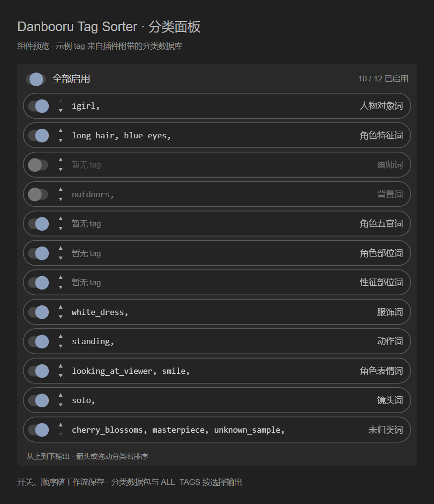

# ComfyUI-Soter-Nodes

ComfyUI 的 Danbooru tag 分类节点。将逗号分隔的提示词按数据库分类，在 Packer 内逐项启用、预览和排序，再输出选中的分类数据包与完整文本。

本仓库基于 [RafealaSilva/ComfyUI-Danbooru-Tag-Sorter-Node](https://github.com/RafealaSilva/ComfyUI-Danbooru-Tag-Sorter-Node) 扩展，保留原节点名称及接口。当前改版为本仓库 **2.2.0**，更新记录见 [CHANGELOG](CHANGELOG.md)。



*上图为实际前端控件在独立浏览器测试页面中的截图，使用示例 tag；不是完整 ComfyUI 工作流运行截图。*

## 安装

在 ComfyUI 的 `custom_nodes` 目录打开终端：

```sh
git clone https://github.com/removeshort-prog/ComfyUI-Soter-Nodes.git
cd ComfyUI-Soter-Nodes
python -m pip install -r requirements.txt
```

这里的 `python` 必须是 **运行 ComfyUI 的 Python**，依赖为 `pandas` 和 `openpyxl`。Windows 官方便携版在上述插件目录中可改用：

```powershell
..\..\..\python_embeded\python.exe -m pip install -r requirements.txt
```

重启 ComfyUI，并刷新浏览器页面。在 `Danbooru Tags` 分类中添加 `Danbooru Tag Sorter (Packer)`。控件随插件加载，无需安装 rgthree。

## 使用分类选择器

1. 在 `tags` 输入框填写或连接逗号分隔的 tag。`excel_file` 默认使用随附的 `danbooru_tags.xlsx`。
2. 原 `new_category_order` 文本框位置显示分类列表：左侧开关控制启用，中间显示分类后的 tag，右侧显示分类名。
3. 使用上下箭头，或拖动右侧分类名调整位置。顶部开关可全部启用或关闭；输出按列表从上到下排列。
4. 运行工作流后查看 tag 预览；点击预览可展开长文本。关闭的分类仍显示预览，便于决定是否启用。预览来自上次运行，修改输入后需再次运行才能更新。
5. 保存工作流即可保存分类顺序和开关状态。开关与排序操作接入 ComfyUI 的撤销/重做事务。

新建节点默认显示并启用全部 12 类，顺序为：画师词、背景词、人物对象词、角色特征词、角色五官词、角色部位词、性征部位词、服饰词、动作词、角色表情词、镜头词、未归类词。

`category_mapping` 中的全部目标分类和 `default_category` 都会出现在列表中。读取旧配置或新增映射时，未列出的分类会追加到末尾，默认关闭，需主动开启。默认分类也可以移动；未匹配的 tag 在该行位置输出，关闭该行后不输出。

### 输出与配套节点

| 节点 / 输出 | 行为 |
| --- | --- |
| Packer → `分类数据包` (`TAG_BUNDLE`) | 按列表顺序保存已启用分类的普通字典。已启用但没有 tag 的分类保留为空字符串；关闭项不会出现在字典中。 |
| Packer → `ALL_TAGS` (`STRING`) | 按相同顺序拼接已启用分类的非空 tag。`is_comment` 控制是否添加分类标题。 |
| `Danbooru Tag Getter (Extractor)` | 连接分类数据包，在 `category_name` 填写分类名，返回对应文本；不存在或已关闭的分类返回空字符串。 |
| `Danbooru Tag Clear Cache` | 清除数据库缓存；修改数据库后也可在 Packer 开启 `force_reload` 重新读取。 |

关闭某个分类时，其中的 tag 会从两个输出中排除，**不会转入“未归类词”**。全部关闭时输出空字典和空字符串。分类内部保持数据库顺序，未匹配的 tag 保持输入顺序；黑名单、正则过滤和去重同时作用于输出与预览。

例如将“镜头词”移到“角色特征词”前，并关闭“角色表情词”，输出就先包含镜头，再包含角色特征，表情 tag 不进入数据包或 `ALL_TAGS`。

## 配置与旧工作流

- `tags_database/danbooru_tags.xlsx` 是内置数据库。`excel_file` 可填该目录中的文件名，或自定义数据库的绝对路径；支持 Excel / CSV，需包含 `english`、`category`、`subcategory` 列。
- `defaults_config.json` 定义新建节点的映射和初始顺序；修改后重启 ComfyUI。已有节点保留工作流内保存的配置。
- `category_mapping` 沿用原字典格式，例如 `{('人物', '眼睛'): '角色特征词'}`，可按数据库的大类、小类重新组合分类。
- `new_category_order` 仍为 `STRING` 输入。新面板保存以下 JSON，数组顺序即输出顺序：

```json
[
  {"name": "镜头词", "enabled": true},
  {"name": "角色特征词", "enabled": true},
  {"name": "角色表情词", "enabled": false},
  {"name": "未归类词", "enabled": false}
]
```

对象数组中未列出的映射分类会补齐为关闭项。`enabled` 应为 JSON 布尔值 `true` / `false`。

旧工作流的分类名称数组（如 `["角色特征词", "未归类词"]`）可直接读取；面板将原有名称转为启用项，补齐遗漏分类为关闭项，并保持其他控件的保存位置。通过 API 直接提交旧名称数组时仍沿用原行为：未列出的映射分类由 `validation` 校验；关闭校验时归入默认分类，Python 调用仍返回原二元组。对象数组模式通过 ComfyUI 的 `ui` / `result` 返回预览及结果，输出插槽类型不变。

如果 `new_category_order` 已转换为输入并连接上游，分类选择和顺序由上游提供，本地面板进入只读预览状态。断开后恢复本地保存的选择。

### 从原插件迁移

1. 备份工作流、原插件的 `defaults_config.json` 和 `tags_database`，以及使用中的外部数据库。
2. 关闭 ComfyUI，将原 `ComfyUI-Danbooru-Tag-Sorter-Node` 文件夹移出 `custom_nodes`，再安装本仓库。两者注册相同节点名，避免同时加载；只改文件夹名称不能防止重复加载。
3. 按需恢复自定义配置和数据库。重新打开旧工作流，检查 `excel_file` 是否仍指向有效路径；使用内置库时填 `danbooru_tags.xlsx`。
4. 重启 ComfyUI，强制刷新浏览器，再确认分类开关与顺序并保存工作流。

原有 Packer、Getter、Clear Cache 节点及连线可继续使用。迁移后可用全开、部分关闭和全关各运行一次，核对实际输出。

[示例工作流](example/Workflow.json) 包含 [ComfyUI-Easy-Use](https://github.com/yolain/ComfyUI-Easy-Use) 的文本预览节点，导入完整示例需安装该依赖；本插件自身不依赖它，也可自行连接可用的文本显示节点。

## 测试

在插件目录执行，Python 环境先安装 `requirements.txt`：

```sh
python -m unittest discover -s tests -v
```

前端测试需要 Node.js 20+、Playwright 和可启动的 Chromium：

```sh
npm install --no-save --package-lock=false playwright
npx playwright install chromium
node --test tests/frontend.test.mjs
```

如果已有环境，可通过 `PLAYWRIGHT_MODULE` 指定可解析的 Playwright 模块路径，通过 `CHROME_EXECUTABLE` 指定 Chrome / Chromium 可执行文件路径；使用现有浏览器时无需下载 Chromium。这些依赖仅用于开发测试，不是 ComfyUI 运行依赖。

本次验证通过 **19 项 Python 测试、12 项浏览器交互场景**（Node TAP 汇总含父测试为 13 项），覆盖启用过滤、顺序、默认分类位置、空输出、Getter、缓存复用、拖动、键盘操作、工作流恢复、连线模式和撤销事务。另已实际加载随附 Excel，索引 **221,784** 个 tag。

浏览器测试运行真实前端控件，但 ComfyUI 的节点、图和事件接口由测试替身提供；尚未在用户的完整 ComfyUI 环境中验证。试用反馈请附 ComfyUI / 前端版本、复现步骤和相关报错。

## 来源与许可

原作者：[RafealaSilva](https://github.com/RafealaSilva)。本次基于上游提交 [`8957613`](https://github.com/RafealaSilva/ComfyUI-Danbooru-Tag-Sorter-Node/commit/8957613905488033f8297e246c5e1adfbe387560) 扩展分类选择器；2.2.0 是本仓库的改版记录，不代表上游官方发布。

沿用 [MIT License](LICENSE)，保留原作者版权声明。
